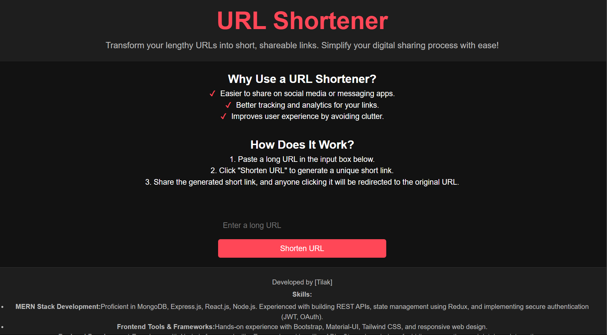

# URL Shortener

This is a simple and modern URL shortener application built using React for the frontend and Node.js with Express for the backend. The application allows users to create shortened URLs and redirects them to the original URLs upon access. The UI features a sleek dark mode design with additional information about URL shortening, its benefits, and a brief section about the developer.

---

## Features
- Shorten long URLs to unique, shareable short links.
- Easy-to-use form with a responsive, dark-themed UI.
- Displays the generated short URL instantly.
- Footer section showcasing the developer's name, skills, and expertise.

---

## Tech Stack

### Frontend
- **React**: For building the user interface.
- **CSS**: For styling the application with a dark theme.

### Backend
- **Node.js**: JavaScript runtime for server-side scripting.
- **Express.js**: Framework for building the REST API.

### Additional Tools
- **Nanoid**: For generating unique short URLs.

---

## How It Works
1. Users enter a long URL into the input field on the main page.
2. The URL is sent to the backend API, where a unique short URL is generated using Nanoid.
3. The backend temporarily stores the mapping of the long URL and the short URL.
4. When a user visits the short URL, they are redirected to the original long URL.

---

## Instructions to Clone and Run Locally

### Prerequisites
- Node.js installed on your system.
- A modern web browser.

### Steps
1. Clone the repository:
    ```bash
    git clone https://github.com/your-username/url-shortener.git
    cd url-shortener
    ```

2. Install dependencies for the backend:
    ```bash
    cd backend
    npm install
    ```

3. Start the backend server:
    ```bash
    npm start
    ```
    The server will start at `http://localhost:5000`.

4. Install dependencies for the frontend:
    ```bash
    cd ../frontend
    npm install
    ```

5. Start the frontend application:
    ```bash
    npm start
    ```
    The application will be available at `http://localhost:3000`.

---

## Folder Structure
```
url-shortener/
├── backend/
│   ├── controllers/
│   │   └── urlController.mjs
│   ├── routes/
│   │   └── urlRoutes.js
│   ├── server.js
│   └── package.json
├── frontend/
│   ├── public/
│   ├── src/
│   │   ├── components/
│   │   │   └── ShortenUrl.jsx
│   │   ├── App.css
│   │   ├── App.jsx
│   │   └── index.js
│   └── package.json
├── README.md
```

---

## About the Developer
**[Tilak]**  
*MERN Stack Developer & Data Analyst*

### Skills
- **Frontend Development**: React, HTML, CSS, JavaScript.
- **Backend Development**: Node.js, Express.js.
- **Data Analysis**: Python (Pandas, NumPy, Matplotlib, Seaborn), Power BI, SQL.
- **Version Control**: Git, GitHub.

Feel free to reach out to collaborate or discuss new ideas!
## Screenshot



